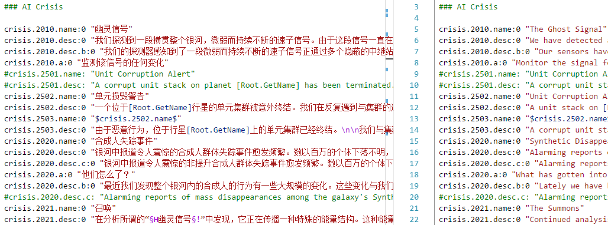

# stellaris-localisation-syntax README

This is a Visual Studio Code extension that colourizes Stellaris localisation files, i.e. .yml files.

## Screenshot

## Release Notes

### 1.0.0

Initial release of Stellaris Localisation Syntax.

### 1.1.0

- Fixed screenshot image
- This suppose to be a patch (v1.0.1), but made a mistake in publishing, so be it.
